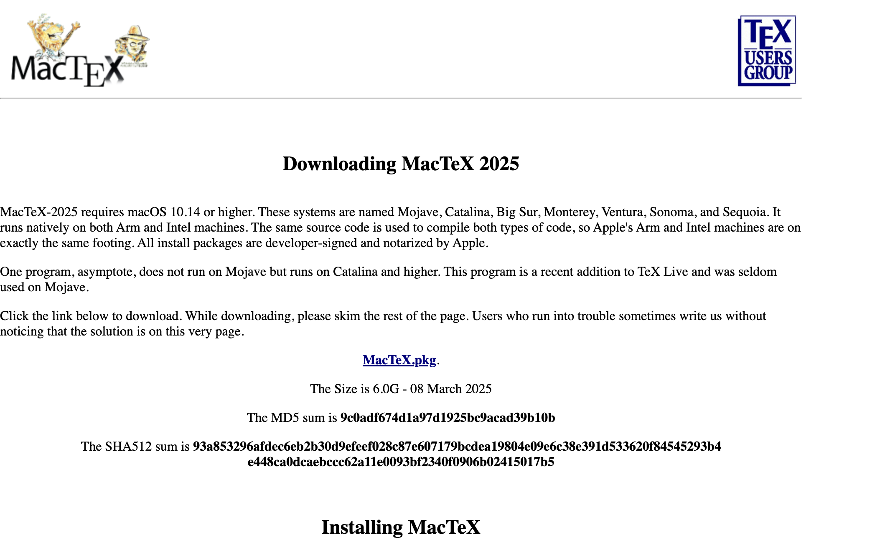
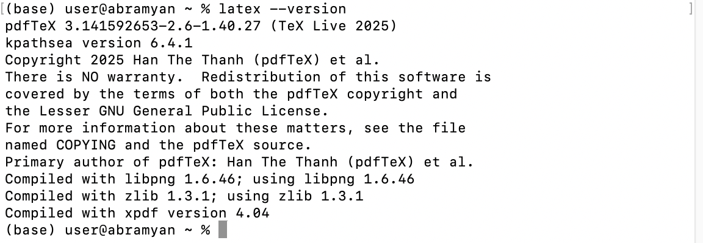

---
## Author
author:
  name: Абрамян Артём Арменович
  email: 1132249518@pfur.ru
  affiliation:
    - name: Российский университет дружбы народов
      country: Российская Федерация
      postal-code: 117198
      city: Москва
      address: ул. Миклухо-Маклая, д. 6

## Title
title: "Лабораторная работа №1"
subtitle: "Установка TeX Live"
license: "CC BY"
---

# Цель работы

Цель данной работы — установить TeX Live на нужную операционную систему.

# Задание

Выполнить следующие задания:

- Выбрать подходящий дистрибутив TeX для операционной системы
- Установить TeX Live
- Проверить корректность установки

# Теоретическое введение

TeX Live — это кроссплатформенный дистрибутив системы компьютерной вёрстки TeX. Он включает в себя основные программы для работы с TeX, а также большую коллекцию макропакетов и шрифтов.

Для разных операционных систем существуют различные варианты установки:

- **Windows**: TeX Live или MiKTeX
- **macOS**: MacTeX (полная версия TeX Live для Mac)
- **Linux**: TeX Live через пакетный менеджер или с официального сайта

Более подробно про установку TeX Live см. в [@kotelnikov_chebotaev_book_latex2_ru; @lvovsky_book_latex_ru].

# Выполнение лабораторной работы

## Выбор дистрибутива

Мне было необходимо установить актуальную версию TeX Live на свою операционную систему (macOS), поэтому я выбрал MacTeX 2025 — специализированный дистрибутив для macOS. На рисунке [-@fig-001] показан процесс выбора и загрузки нужного дистрибутива.

{#fig-001 width=70%}

MacTeX включает в себя полную версию TeX Live, а также дополнительные утилиты и редакторы, оптимизированные для macOS, такие как TeXShop и BibDesk.

## Процесс установки

После загрузки дистрибутива началась установка. Процесс установки MacTeX включает распаковку всех необходимых пакетов и настройку окружения. Как видно из рисунка [-@fig-002], установка прошла успешно.

{#fig-002 width=70%}

После завершения установки система TeX Live готова к работе. Все необходимые команды (такие как `pdflatex`, `xelatex`, `bibtex`) доступны из командной строки.

## Проверка установки

Для проверки корректности установки можно выполнить следующие команды в терминале:

```bash
# Проверка версии pdflatex
pdflatex --version

# Проверка версии xelatex
xelatex --version

# Проверка менеджера пакетов
tlmgr --version
```

Если команды выполняются без ошибок и выводят информацию о версиях, установка прошла успешно.

# Выводы

В данной лабораторной работе была выполнена установка TeX Live на операционную систему macOS. Освоили:

- Процесс выбора подходящего дистрибутива TeX для операционной системы
- Установку MacTeX 2025 — полнофункционального дистрибутива TeX Live для macOS
- Проверку корректности установки через командную строку

Установленная система TeX Live готова к работе и включает все необходимые компоненты для создания документов в LaTeX. Процесс установки подробно проиллюстрирован на рисунках [-@fig-001] и [-@fig-002].

# Список литературы{.unnumbered}

::: {#refs}
:::
