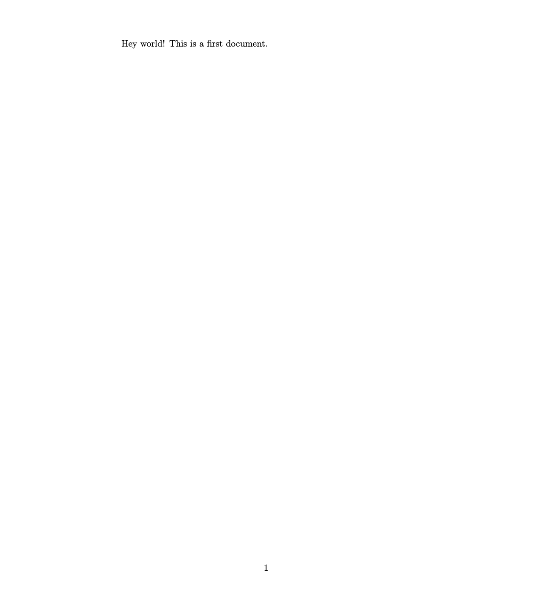
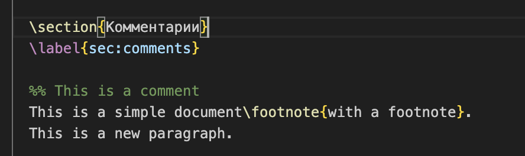
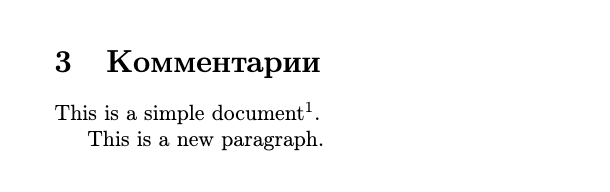
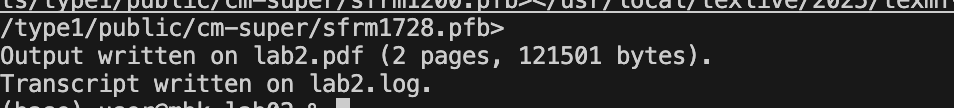
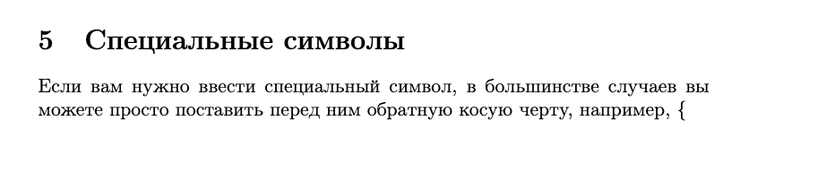
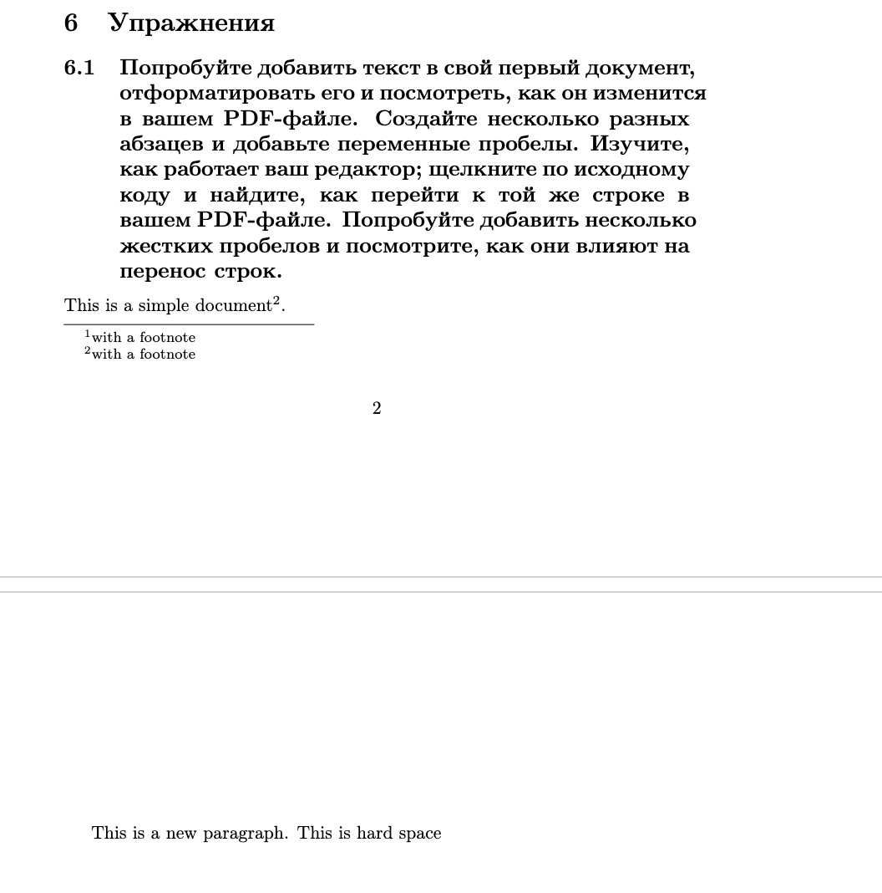

---
## Author
author:
  name: Абрамян Артём Арменович
  email: 1132249518@pfur.ru
  affiliation:
    - name: Российский университет дружбы народов
      country: Российская Федерация
      postal-code: 117198
      city: Москва
      address: ул. Миклухо-Маклая, д. 6

## Title
title: "Лабораторная работа №2"
subtitle: "Работа с документом в LaTeX"
license: "CC BY"
---

# Цель работы

Цель данной работы — изучить структуру документа в LaTeX согласно документации, научиться запускать latex.

# Задание

Выполнить следующие задания:

- Повторить примеры, приведенные в теоретической части.
- Выполнить задания для самостоятельной работы.

# Теоретическое введение

Документы LaTeX представляют собой смесь текста и команд. Команды начинаются с обратной косой черты и иногда имеют аргументы в фигурных скобках (или иногда необязательные аргументы в квадратных скобках). Затем вы получаете выходной PDF-файл, указав LaTeX выполнить верстку вашего файла.

Более подробно про LaTeX см. в [@kotelnikov_chebotaev_book_latex2_ru; @lvovsky_book_latex_ru].

# Выполнение лабораторной работы

## Базовая структура

Базовая структура документа LaTeX включает класс документа, преамбулу и тело документа. Простейший пример показан на рисунке [-@fig-001].

{#fig-001 width=70%}

Как видно из рисунка [-@fig-001], минимальный документ LaTeX содержит команду `\documentclass`, окружение `document` и собственно текст.

## Комментарии

Комментарии к файлу LaTeX можно добавлять, начиная их с символа `%`. Всё, что следует после процента до конца строки, игнорируется компилятором. Пример использования комментариев представлен на рисунке [-@fig-002].

{#fig-002 width=70%}

Комментарии полезны для временного отключения частей кода или добавления пояснений в исходный файл.

## Параграфы

Как вы видите на рисунке [-@fig-003], у нас два абзаца: обратите внимание на использование пустой строки для разделения абзацев.

{#fig-003 width=70%}

В LaTeX пустая строка в исходном коде создаёт новый абзац в выходном документе. Несколько пустых строк эквивалентны одной пустой строке.

## Запуск LaTeX

Мы можем преобразовать наш LaTeX документ в PDF, используя команду `pdflatex`. Процесс компиляции показан на рисунке [-@fig-004].

{#fig-004 width=70%}

Команда `pdflatex lab2.tex` компилирует исходный файл и создаёт выходной PDF-файл с тем же именем.

## Специальные символы

Если нам нужно ввести специальный символ, в большинстве случаев мы можем просто поставить перед ним обратную косую черту. Например, для вывода фигурных скобок используется `\{` и `\}`. Примеры использования специальных символов показаны на рисунке [-@fig-005].

{#fig-005 width=70%}

К специальным символам в LaTeX относятся: `#`, `$`, `%`, `&`, `_`, `{`, `}`, `^`, `~`, `\`. Для их вывода в тексте необходимо экранирование.

# Упражнения

## Работа с форматированием текста

Попробуем добавить текст в документ, отформатировать его и посмотреть, как он изменится в PDF-файле. Создадим несколько разных абзацев и добавим переменные пробелы. Результат эксперимента показан на рисунке [-@fig-006].

{#fig-006 width=70%}

Как видно из рисунка [-@fig-006], жесткие пробелы (неразрывные пробелы `~`) влияют на перенос строк, предотвращая разрыв между словами.

# Выводы

В ходе данной работы мы изучили структуру документа в LaTeX. Освоили:

- Базовую структуру документа с командами `\documentclass` и окружением `document`
- Использование комментариев для документирования кода
- Создание абзацев с помощью пустых строк
- Процесс компиляации LaTeX документа в PDF с помощью команды `pdflatex`
- Работу со специальными символами и их экранирование
- Влияние жестких пробелов на форматирование текста

Особое внимание было уделено практическим примерам и упражнениям, которые помогли закрепить полученные знания. Все рисунки в отчете (рис. [-@fig-001] - [-@fig-006]) иллюстрируют основные концепции работы с документами LaTeX.

# Список литературы{.unnumbered}

::: {#refs}
:::
